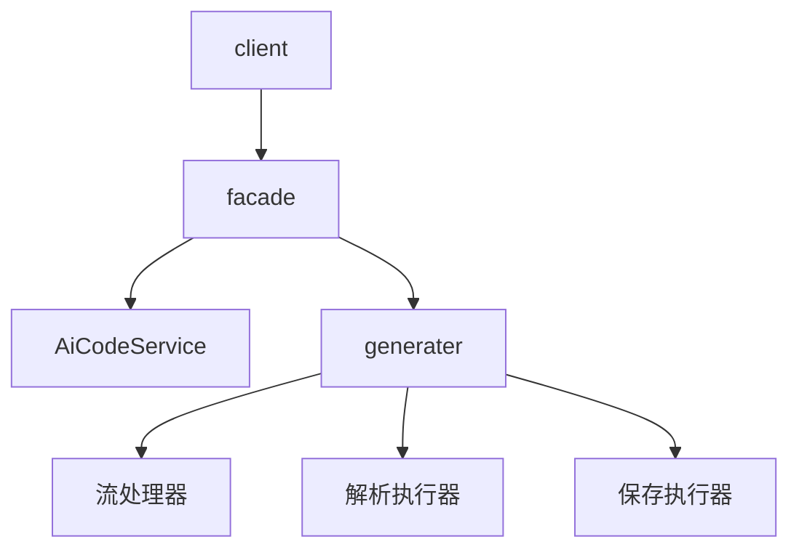
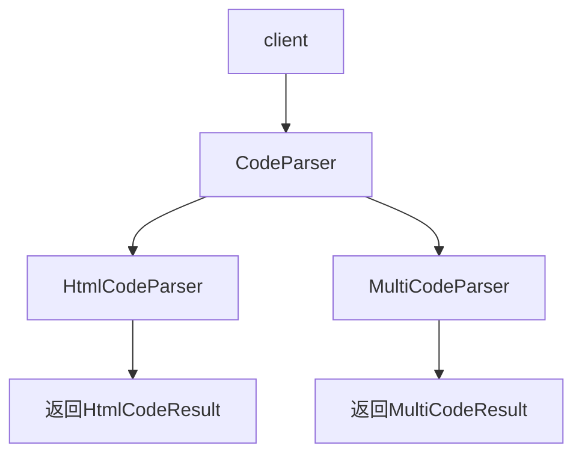

# 项目架构分析

本文分析系统的各部分内容，从需求分析到实现思路，以及关键部分的重点思路梳理。


# 用户模块

## 需求分析

用户模块包括以下功能：

- 用户注册
- 登录
- 获取当前登录用户
- 用户注销
- 用户权限控制
- 管理用户【管理员】

具体分析每个需求：

1. 用户注册：用户通过输入帐号、密码、确认密码进行注册
2. 用户登录：用户输入帐号和密码登录
3. 获取当前登录用户：得到当前已登录的用户信息
4. 用户权限控制：用户分为管理员和普通用户，管理员拥有系统最高权限，比如可以管理其他用户
5. 用户管理：仅管理员可用，对整个系统的用户进行管理，如搜索、删除


## 登录流程

1. 建立初始会话：前端与服务器建立连接后，服务器会创建一个初始匿名 Session，将其状态保存下来。Session 的 ID 会作为唯一标识返回给前端。
2. 登录成功，更新会话信息：登录业务方法执行成功时，手动将相关信息保存至 Session 关联的存储中（Session 对象内部有封装存储空间）。同时，在手动调用 getSession 方法创建新 Session 时，服务器会生成一个 Set-Cookie 的响应头，指示前端保存该用户的 Session ID。
3. 前端带 Cookie 的后续请求中，服务器会从 Session 中获得 Session ID，从而找到对应的 Session 数据。
4. 通过导入 Redisson，可以自动使用 Redis 管理 Session:
   1. Spring 通过 SessionRepository 管理 Session
   2. Redisson 的 RedisSessionRepository 实现了 SessionRepository 接口
   3. 在处理 Session 时，会由 RedisSessionRepository 代替默认的 MapSessionRepository，接管 Session

## 权限控制

通过 AOP + 自定义注解实现，通过 request 获取 Session 信息，

从 Session 中提取登录用户信息，校验登录用户的权限是否与注解权限相匹配。


### 区别于 Spring Security

Spring Security 使用 AuthenticationProvider 提供鉴权，并通过 AuthenticationManager 调用 Provider 实现鉴权功能。


# AI 模块

## 需求分析

让 AI 根据用户的描述，生成完整的网页应用。

- 原生 HTML
- 原生多文件（index.html, style.css, script.js）
- Vue 项目


AI 应用的核心流程如下：

用户输入 -> AI LLM 生成 -> 提取生成内容 -> 写入本地文件

针对 AI 生成，可以选择不同的 AI 模型。本项目选择使用 Langchain4j 框架接入。

## Langchain4j 

Langchain4j 是主流的 Java AI 开发框架之一。支持丰富的 AI 模型。

大致开发流程如下：

1. 该框架推荐使用 AI Service 开发模式，创建 AI 服务接口，并通过系统注解的方式，为接口方法指定系统提示词路径。

2. 再通过 AiServices.create 方法创建指定 AI 服务接口的代理实现类。在这个过程中可以注入默认的 ChatModel 实现，也可自定义 ChatModel。

3. AI 服务接口可以返回 Java 对象类型，因此可以做结构化输出。为了稳定性，可以在系统提示词中再次强调 AI 应返回的回答结构。

   - OpenAI 相关文档提到可以使用 `model.supportedCapabilities(RESPONSE_FORMAT_JSON_SCHEMA)` 确保结构化输出，但 deepseek 不支持

   - deepseek 支持使用 `response_format` 配置实现输出格式化

     ```yaml
     langchain4j:
       open-ai:
         chat-model:
           strict-json-schema: true
           response-format: json_object
     ```

4. 为结果类添加详细的描述信息，可以便于 AI 理解

   ```java
   @Description("生成 HTML 代码文件的结果")
   @Data
   public class HtmlCodeResult {
   
       @Description("HTML代码")
       private String htmlCode;
   
       @Description("生成代码的描述")
       private String description;
   }
   
   ```

5. 若使用流式响应，则无法结构化输出（显而易见）。此时可以通过 Flux 或 TokenStream 作为 AI 服务的返回类型，Langchain4j 将会返回流。

   - Flux<String> 是通用响应式编程，拥有丰富的 API 操作，支持背压，功能强大

   - TokenStream 是 Langchain4j 提供的为 AI 流式响应设计的接口，背压支持有限，有更多高级回调，使用简单。若要流式返回给前端，则还需要再封装为 Flux。

   - 使用流式响应需要配置 Langchain4j 的流式模型

     ```yaml
     langchain4j:
       open-ai:
         streaming-chat-model:
           base-url: https://api.deepseek.com
           api-key: <Your API Key>
           model-name: deepseek-chat
           max-tokens: 8192
           log-requests: true
           log-responses: true
     ```


## 设计模式

项目截止至此，发现 AI 服务的架构可以重新设计。

- 首先，客户端需要通过 AI 服务类调用不同类型的项目；

- 不同类型的项目对应不同类型的代码解析器、代码保存器。

因此，可以通过设计模式进行项目重构：

- 使用门面模式提供统一高层接口，提供 AI 生成代码的统一接口
- 门面模式内部使用执行器，根据指定类型判断要执行哪种代码解析器
- 门面模式内部使用执行器，根据指定类型判断要执行哪种代码保存器
- 代码解析器使用策略模式设计，包括 HTML、MULTI。由于 Vue 项目会在流传输完成后构建，因此无需为其专门设计一个策略，使用 MULTI 即可。
- 代码保存器使用模板方法模式设计，提供统一的保存流程及写入文件方法

最终，

### 门面模式

为统一保管生成和保存逻辑，可以使用门面模式。

门面模式提供一个统一的高层接口来隐藏子系统的复杂性。



### 策略模式

策略模式定义一系列算法，将每个算法独立封装，让它们可以相互替换。

算法的变化不会影响算法的代码，提高项目维护和扩展性。



### 模板方法模式

模板方法模式在抽象父类中定义了操作的标准流程，将具体实现步骤交给子类，使子类可以在不改变流程的情况下重新定义特定步骤。


## 运行轨迹

本块内容为业务核心方法（即 登录用户调用 AI 生成项目）的 从用户请求、封装请求、AI 生成响应 到 封装响应、返回前端 的全流程分析。

### 完整链路

完整的 业务链路包括如下步骤：

1. 前端请求创建 APP 接口

   1. 后端创建 APP

   2. 存储首个用户提示词（初始化提示词）

   3. 根据提示词生成 App 名称

   4. 返回 App 视图

2. 前端携带 APP ID，访问生成代码接口

   1. 后端调用服务生成业务代码

   2. Controller 层调用并处理 Service 返回的流

      1. 将分块进行处理，转换为 Json 格式，以解决空格丢失的问题

      2. 通过 `concatWith` 在流结束时，发送结束事件，告知前端

         ```java
         flux.map(分块处理)
             .concatWith(Mono.just(
              // 发送结束事件
              ServerSentEvent.<String>builder()
                             .event("done")
                             .data("")
                             .build()));
         ```

   3. Service 层调用 AI 生成，对 AI 流进行一系列操作

      1. 根据初始提示词获取 AI 生成模式
      2. 保存用户消息到数据库
      3. 设置监控上下文（用于 Prometheus）
      4. 调用 AI 生成服务，其内部根据不同生成模式，对流进行不同的处理。其职责为生成代码并保存生成结果（及构建 vue 项目）。
         - 对于 HTML、多文件原生模式，只是保存输出结果到 StringBuilder，并在执行完毕后通过代码解析器解析，最后通过保存器保存文件
         - 对于 Vue 模式，使用 Langchain4j 的 TokenStream 接收并处理 AI 返回流，将返回内容封装。为后续处理，还需要将 TokenStream 封装为 Flux 流并返回。
      5. 调用消息执行器，其内部根据不同模式进行不同处理，返回流。其职责为收集 AI 响应结果并在结束后添加消息到对话历史。
         - Vue 模式较为特殊。在上一步中，对 Vue 的 AI 响应进行了封装，此时需要根据不同 AI 响应类型进行不同操作。
         - 对于普通 AI 响应，直接拼接并返回响应内容
         - 对于工具调用请求，若是第一次调用指定工具，则记录并返回工具信息，否则返回空
         - 对于工具调用结果，获取工具调用结果并拼接到历史内容，返回调用结果
      6. 清空监控上下文（防止内存占用）


### 用户请求

项目将 “从【用户在首页输入要求并点击生成】到【AI 开始生成】” 之间的流程归为 ”用户请求“。

首先，前端携带用户提示词，请求创建 APP 接口。该接口职责如下：

1. 参数校验

2. 创建 APP，构建内部信息，设置作者、初始提示词、根据提示词生成 App 名称

3. 调用 **AI 路由服务**（下文会介绍），根据用户提示词给出 生成模式（Html、MultiFile、Vue 三者其中的一个）。设置给 App 对象。
   1. 通过 AI 路由服务工厂获取 AI 路由服务
   2. 调用 AI 路由服务的 获取生成模式方法

4. 保存 App，返回 AppId


在获得 App ID 后，前端携带用户提示词与 AppId 访问通用的 ”生成代码“ 接口。该接口职责如下：

1. 校验参数

2. 获取登录用户，调用 Service 的生成代码，得到 AI 响应流

3. 对响应流进行处理并返回。

   1. 将每个响应分块打包为 json，以防丢失空格等

   2. 在响应结束后，发送结束事件

      ```java
              return contentFlux.map(chunk -> {
              // 打包为 JSON
              Map<String, String> map = Map.of("d", chunk);
              String jsonStr = JSONUtil.toJsonStr(map);
              return ServerSentEvent.<String>builder()
                                    .data(jsonStr)
                                    .build();
          })
          .concatWith(Mono.just(
              // 发送结束事件
              ServerSentEvent.<String>builder()
                             .event("done")
                             .data("")
                             .build()));
      ```

      

### AI 请求与响应处理

在前端请求生成代码之后，需要调用 Service 的 AI 生成代码方法，同时对方法返回的响应流进行处理。这个过程归为 ” AI 请求与响应处理“ 阶段。

首先，前端请求生成代码后，Controller 会调用 Service 的 AI 生成代码方法。该方法接收 appId，用户消息 以及登录用户。该方法返回 Flux 流。

1. 参数校验

2. 获取应用信息并校验权限

3. 保存消息到历史消息数据库，包括 appId、消息类型（USER、AI）、用户 ID

4. 设置监控上下文，将 appId、用户 Id 保存至监控上下文，用于 Prometheus 的监控

5. 调用 **AI 门面类**（下文会介绍）的生成并保存代码方法，传入 appId、用户消息及生成类型。门面类将会进行以下操作：

   1. 通过 AI 服务工厂，根据 appId 获取相应的 AI 服务

   2. 对于原生生成模式，收集响应的信息，并在流结束时拼接全部信息，使用解析器解析代码，使用保存器保存文件。

   3. 对于 Vue 生成模式，返回新的流，流内部通过 TokenStream 处理不同请求，并**封装为不同对象**（下文会介绍）

      - onPartialResponse：处理普通的 AI 响应信息，封装为 AiResponseMessage 并推送
      - onPartialToolExecutionRequest：处理工具调用请求，封装为 ToolRequestMessage 并推送
      - onToolExecuted：处理工具调用结果请求，封装为 ToolExecution 并推送
      - onCompleteResponse：流结束，构建 vue 项目，发布流结束事件
      - onError：异常处理

      ```java
      return Flux.create(sink -> {
             tokenStream.onPartialResponse((String partialResponse) -> {sink.next(封装结果);})
                        .onPartialToolExecutionRequest((index, toolExecutionRequest) -> {sink.next(封装结果);})
                        .onToolExecuted((ToolExecution toolExecution) -> {sink.next(封装结果);})
                        .onCompleteResponse((ChatResponse response) -> {
                            // 构建 vue 项目
                           vueProjectBuilder.buildProjectAsync(projectPath);
                            // 发布流结束事件
                            sink.complete();})
                        .onError((Throwable error) -> {
                          // 异常处理
                            sink.error(error);})
                        // 开始监听
                        .start();
              });
      ```

   4. 由于 Vue 项目构建时，会进行工具调用，因此无需再解析、保存代码文件。

6. 调用消息执行器，传入 AI 响应流、对话历史服务、appId、登录用户、生成类型，用于保存 AI 生成的消息到对话历史中。对于 Vue 项目，由于之前进行了消息封装，这里需要特殊处理。

   1. 解析每个 Json 消息块，根据不同的类型转为不同字符串，并拼接
   2. 对解析的字符串进行处理，过滤空字符串
   3. 流响应完成后，添加完整 AI 消息到对话历史


## 实现细节

### AI 路由服务工厂


### AI 路由服务


### AI 门面类


### AI 服务工厂


### AI 服务


### 响应封装类


### 监控（Prometheus）


# 应用模块

## 需求分析

将 AI 模块升级为平台化系统，支持多应用、应用管理、在线部署等功能。

- 创建/编辑/删除/查看/分页查询应用
- 精选应用
- 实时查看应用效果
- 应用部署
- 管理应用

大体流程是，用户输入提示词后，系统创建一个应用记录，跳转到对话页面与 AI 交互。

交互过程可见，生成后可以预览效果，满意后进行部署，让网站对外提供服务。

## 应用基础功能

**创建应用**

用户创建应用时，填写初始化提示词，系统生成应用名称和默认代码类型。

代码类型在后续接入智能路由，通过 AI 选择不同类型。

**修改/删除应用**

用户进行权限校验，只能更新自己的应用，管理员可以修改所有应用

## 应用高级功能

要将 AI 模块与应用模块进行集成，业务流程如下：

1. 用户输入提示词后创建应用
2. 获得应用 ID，跳转到对应的对话页面
3. 系统自动使用用户提交的提示词与 AI 对话

即，前端的流程为 获取 AppId -> 携带 AppId 调用 AI 对话窗口

后端根据 AppId 区分不同应用，应用生成路径与部署路径均以 AppId 为主要标识符。

**流式接口**

接口层使用 Flux 以支持 SSE 流式返回，尽量使用 GET 请求，方便前端 EventSource 对接。

此外，还要对接口进行优化，解决如下问题：

1. 空格丢失问题

   AI 返回的数据若不进行封装，可能会导致空白符丢失。可以通过多种办法解决该问题，如：

   - 封装入 Json 中 `{'d': 'content '}`
   - 进行加密，前端解密
   - 后端对空格转义，前端再转义回去

2. 区分流关闭类型

   SSE 中，服务器关闭连接时会触发客户端的 `onclose` 事件。但是，连接正常结束和异常中断等场景都会触发该事件。因此，最好明确定义事件，区分流的正常结束和异常中断。

   ```java
       // 调用服务生成代码（流式）
       Flux<String> contentFlux;
       // 转换为 ServerSentEvent 格式
       return contentFlux
               .map(chunk -> {
                   // 将内容包装成JSON对象
                   return ServerSentEvent.<String>builder()
                           .data(jsonData)
                           .build();
               })
               .concatWith(Mono.just(
                       // 发送结束事件
                       ServerSentEvent.<String>builder()
                               .event("done")
                               .data("")
                               .build()            ));}
   
   ```

   

## 应用部署

有两种部署方案：

- 同一个服务器的不同目录
- 不同服务器，同步到远程服务器

按成本来说，部署到同一服务器的成本更低。

**部署技术选型**：

1. 使用 Serve

   最简单的方案，使用 node 的 serve 快速启动一个 web 服务器。

   但性能较低，且依赖 node 环境，需要独立启动 Web 服务进程。

2. 通过 Spring Boot 接口

   后端提供一个静态资源服务接口，根据部署路径返回相应的文件。

   无需额外进程，非常方便，但功能相对简单。

3. 使用 Nginx 映射

   将请求代理到部署目录中

   ```conf
   # 静态资源服务器 - 80 端口
   server {
       listen       80;
       server_name  localhost;
       charset      utf-8;
       charset_types text/css application/javascript text/plain text/xml application/json;
       # 项目部署根目录
       root         /tmp/code_deploy;
       
       # 处理所有请求
       location ~ ^/([^/]+)/(.*)$ {
           try_files /$1/$2 /$1/index.html =404;
       }
   }
   
   ```

   性能最佳，适合生产环境，但需要额外引入 Nginx 组件。

4. 使用 COS/OSS 对象存储的静态网站访问能力，同时实现存储 + 访问。但需要自定义域名。

